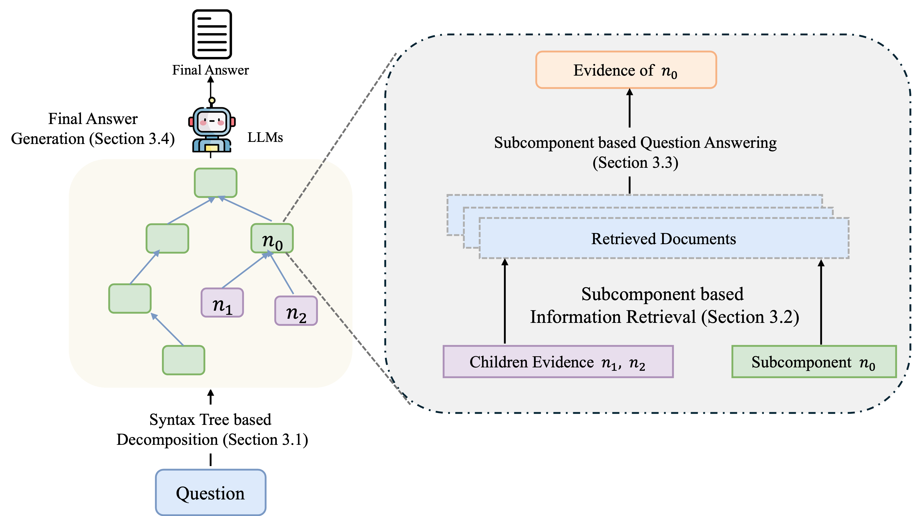

# TreeRare: Syntax Tree-Guided Retrieval and Reasoning for Knowledge-Intensive Question Answering
This repo includes the code implementation of the [TreeRare](https://arxiv.org/abs/2506.00331) and the code for the experiments.

If you find our code or the paper useful, please cite the paper:
```
@misc{zhang2025treeraresyntaxtreeguidedretrieval,
      title={TreeRare: Syntax Tree-Guided Retrieval and Reasoning for Knowledge-Intensive Question Answering}, 
      author={Boyi Zhang and Zhuo Liu and Hangfeng He},
      year={2025},
      eprint={2506.00331},
      archivePrefix={arXiv},
      primaryClass={cs.CL},
      url={https://arxiv.org/abs/2506.00331}, 
}
```

## Installing Dependency
```bash
git clone git@github.com:billycrapediem/TreeRare.git
cd TreeRare
conda env create -f environment.yml
conda activate TreeRare
pip install -r requirements.txt
mkdir output_dir
mkdir data
```
We directly uses BM25 implemented through pyserini as retriver. 

## Code organization
The code is organizaed as follows:
- prompt (prompt file)
      - Ambig_Doc.txt (zero-shot cot prompt for ambigdocqa)
      - asqa_prompt.txt (zero-shot cot prompt for asqa)
      - hotpot_cot.txt (few-shot cot prompt for hotpotqa)
- script
      - deploy.sh (script for deploying llama3.3-70b)
      - df1.sh (evaluating the performance on ASQA)
      - experiment.sh (script to run all the experiment)
- src
      - eval
            - disambigF1.py (generate df1 score)
            - eval_ambigdoc.py(evalute the performance on ambigdocqa)
            - eval_multi_hop.py (evaluate the performance on multihop-qa)
      - ambigdoc_inference.py (run experiment on ambigdocqa)
      - asqa_inference.py (run experiment on asqa)
      - BM25.py (code for BM25 retriever)
      - consituency_tree.py (code for the consituency tree)
      - dependency.py (code for dependency tree)
      - dpr.py (code for dpr retriever)
      - hoppotqa_inference.py (run experiment on  multihop-qa)
      - traverse_algo.py (traversing over the syntax tree)
      - utils.py (contians bunch of utility function)
## Dataset
In our exerpiment script, all the datasets are inthe `./data` folder. And all the model output is under `./output_dir' folder. 
Access and download the ASQA dataset [here](https://github.com/google-research/language/tree/master/language/asqa).
Access and download the AmbigDocQA dataset [here](https://ambigdocs.github.io/).
Access and download the HotpotQA dataset [here](https://hotpotqa.github.io/).
Access and download the MuSiQue dataset [here](https://github.com/StonyBrookNLP/musique).
Access and download the 2WikiMultihopQA dataset [here](https://github.com/Alab-NII/2wikimultihop).

## Reproducing experiments
before runing experiment, you need to add your own api key and the model name into the `experiment.sh` file. 
``` bash
sh script/experiment.sh
```