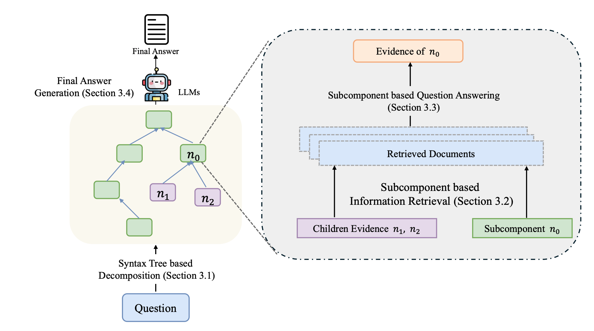

# TreeRare: Syntax Tree-Guided Retrieval and Reasoning for Knowledge-Intensive Question Answering
This repo includes the code implementation of the [TreeRare](https://arxiv.org/abs/2506.00331) and the code for the experiments.

If you find our code or the paper useful, please cite the paper:
```
@misc{zhang2025treeraresyntaxtreeguidedretrieval,
      title={TreeRare: Syntax Tree-Guided Retrieval and Reasoning for Knowledge-Intensive Question Answering}, 
      author={Boyi Zhang and Zhuo Liu and Hangfeng He},
      year={2025},
      eprint={2506.00331},
      archivePrefix={arXiv},
      primaryClass={cs.CL},
      url={https://arxiv.org/abs/2506.00331}, 
}
```

## Installing Dependency
```bash
git clone git@github.com:billycrapediem/TreeRare.git
cd TreeRare
conda env create -f environment.yml
conda activate TreeRare
pip install -r requirements.txt
mkdir output_dir
mkdir data
```
We directly uses BM25 implemented through pyserini as retriver. 

## Directory Structure

```plaintext
.
├── prompt/                     # Prompts used for CoT and zero-shot/few-shot settings
│   ├── Ambig_Doc.txt           # Zero-shot CoT prompt for AmbigDocQA
│   ├── asqa_prompt.txt         # Zero-shot CoT prompt for ASQA
│   └── hotpot_cot.txt          # Few-shot CoT prompt for HotpotQA
│
├── script/                     # Shell scripts for deployment and running experiments
│   ├── deploy.sh               # Script for deploying LLaMA 3.3-70B model
│   ├── df1.sh                  # Evaluate DF1 performance on ASQA
│   └── experiment.sh           # Run all experiments sequentially
│
├── src/                        # Source code
│   ├── eval/                   # Evaluation scripts
│   │   ├── disambigF1.py       # Compute Disambiguation F1 score
│   │   ├── eval_ambigdoc.py    # Evaluate performance on AmbigDocQA
│   │   └── eval_multi_hop.py   # Evaluate performance on multi-hop QA
│   │
│   ├── ambigdoc_inference.py   # Run inference on AmbigDocQA
│   ├── asqa_inference.py       # Run inference on ASQA
│   ├── BM25.py                 # BM25 retriever implementation
│   ├── consituency_tree.py     # Constituency parse tree utilities
│   ├── dependency.py           # Dependency tree parser
│   ├── dpr.py                  # Dense Passage Retriever (DPR) code
│   ├── hoppotqa_inference.py   # Run inference on HotpotQA (multi-hop)
│   ├── traverse_algo.py        # Tree traversal algorithms
│   └── utils.py                # Miscellaneous utility functions
```

## Dataset
In our exerpiment script, all the datasets are inthe `./data` folder. And all the model output is under `./output_dir' folder. 
Access and download the ASQA dataset [here](https://github.com/google-research/language/tree/master/language/asqa).
Access and download the AmbigDocQA dataset [here](https://ambigdocs.github.io/).
Access and download the HotpotQA dataset [here](https://hotpotqa.github.io/).
Access and download the MuSiQue dataset [here](https://github.com/StonyBrookNLP/musique).
Access and download the 2WikiMultihopQA dataset [here](https://github.com/Alab-NII/2wikimultihop).

## Reproducing experiments
before runing experiment, you need to add your own api key and the model name into the `experiment.sh` file. 
``` bash
sh script/experiment.sh
```